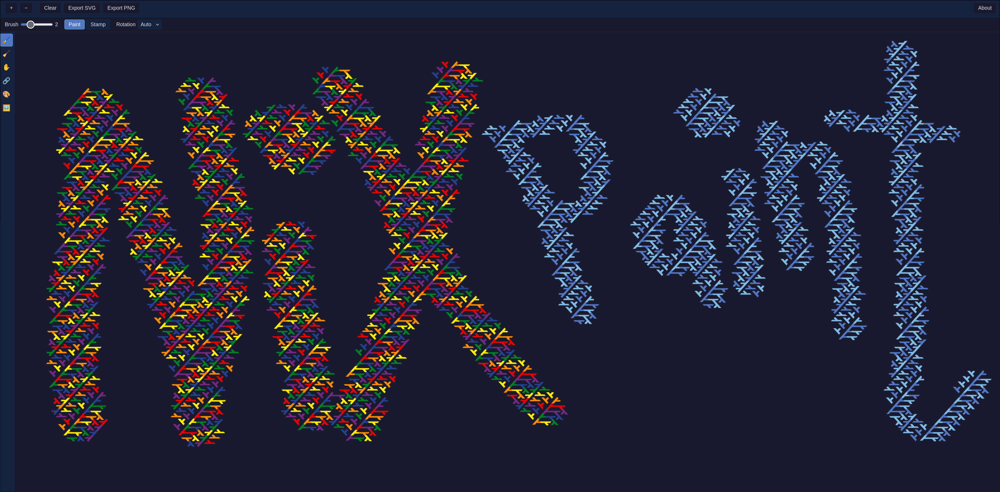

# Nixpaint

An online paint application where you paint with Nix lambda shapes. Lambdas are stamped along your brush strokes onto a hex grid, auto-rotated to tile seamlessly — just like the NixOS snowflake logo.



## Features

- **Infinite SVG canvas** with pan and zoom
- **Hex grid painting** with Nix lambda shapes
- **Multiple tools**: Paint, Erase, Pan, Node (point-to-point lines)
- **Brush and eraser width** control
- **Color palettes**: Nix Blue, NixOS Rainbow, Grayscale
- **Color cycling mode** for automatic palette rotation
- **Rotation control**: auto-cycle or fixed angle
- **Background color** selection with optional export
- **Undo/redo** with Ctrl+Z / Ctrl+Shift+Z
- **Export** to SVG and PNG
- **Auto-save** to local storage

## Development

### Prerequisites

- [Nix](https://nixos.org/download/) with flakes enabled

### Setup

```bash
nix develop
pnpm install
```

### Commands

```bash
pnpm dev          # Start dev server with HMR
pnpm build        # Build for production
pnpm lint         # Check lint and formatting (Biome)
pnpm format       # Auto-fix lint and formatting
pnpm typecheck    # TypeScript type checking
pnpm test         # Run unit tests (Vitest)
pnpm test:e2e     # Run E2E tests (Playwright)
```

### Build with Nix

```bash
nix build
# Static site output in ./result/
```

### Release

```bash
./scripts/release.sh
```

Prompts for major/minor/patch, updates CHANGELOG.md and package.json, tags, pushes, and creates a GitHub release.

## Tech Stack

- React + TypeScript
- Vite (build)
- Zustand (state)
- Biome (lint + format)
- Vitest (unit tests)
- Playwright (E2E tests)
- Nix flake (dev environment + build)

## Contributing

1. Fork the repository
2. Create a feature branch
3. Add your changes and update the `[Unreleased]` section in `CHANGELOG.md`
4. Run `pnpm lint && pnpm typecheck && pnpm test` before submitting
5. Open a pull request

## License

[MIT](LICENSE) - Pim Snel

## Links

- **Website**: [nixpaint.extranix.com](https://nixpaint.extranix.com)
- **Author**: [extranix.com](https://extranix.com)
